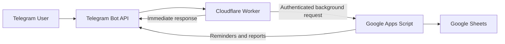

# PulseTask

A personal Telegram productivity assistant powered by **Cloudflare Workers**, **Google Apps Script**, and **Google Sheets**.

PulseTask reads your weekly schedule from Google Sheets, sends Telegram reminders, records task actions and energy levels, creates reports, and moves interrupted tasks to the next available time.

> Personal edition: one user, no VPS, no paid database, and no always-on computer.

---

# Start here

Follow the steps below **in order**. Do not skip a step.

By the end, you will have:

- A Telegram bot
- A Google Sheet containing your weekly schedule
- A deployed Google Apps Script backend
- A deployed Cloudflare Worker
- A working Telegram webhook
- Automatic reminders every five minutes

## What you need

- Google account
- Telegram account
- Cloudflare account
- Node.js 22 or newer
- Git
- Windows PowerShell or another terminal

Check Node.js and npm:

```powershell
node --version
npm --version
```

---

# Project files

```text
PulseTask/
├── README.md
├── apps-script/
│   └── Code.gs
└── cloudflare-worker/
    ├── package.json
    ├── wrangler.jsonc
    └── src/
        └── index.js
```

---

# Step 1 — Download the project

```powershell
git clone https://github.com/Pouya-Mansournia/PulseTask.git
cd PulseTask
```

Or download the repository as a ZIP from GitHub and extract it.

---

# Step 2 — Create your Telegram bot

1. Open Telegram.
2. Search for the verified account `@BotFather`.
3. Send:

```text
/newbot
```

4. Enter a display name, for example:

```text
PulseTask
```

5. Enter a username ending in `bot`, for example:

```text
my_pulse_task_bot
```

6. BotFather gives you a token similar to:

```text
1234567890:AAExampleToken
```

Save it securely. This value is your:

```text
TELEGRAM_BOT_TOKEN
```

7. Open your new bot and send:

```text
/start
```

Do not publish the token or commit it to GitHub.

---

# Step 3 — Get your Telegram chat ID

Open PowerShell and run:

```powershell
$BOT_TOKEN = "PASTE_YOUR_TELEGRAM_BOT_TOKEN"

Invoke-RestMethod `
  -Uri "https://api.telegram.org/bot$BOT_TOKEN/getUpdates"
```

Look for:

```text
message
  chat
    id
```

Example:

```json
{
  "message": {
    "chat": {
      "id": 123456789
    }
  }
}
```

Save the numeric value as:

```text
TELEGRAM_CHAT_ID
```

If the response contains no messages, send `/start` to your bot again and repeat the command.

---

# Step 4 — Create the Google Sheet

Create a new Google Sheet.

Rename the main tab to:

```text
Time/Plan
```

In row 1, add these exact headers:

```text
Start | Finish | Time Duration | State | Saturday | Sunday | Monday | Tuesday | Wednesday | Thursday | Friday
```

Example:

| Start | Finish | Time Duration | State | Saturday | Sunday | Monday |
|---|---|---|---|---|---|---|
| 06:30 | 08:00 | 01:30 | Health/GYM | Gym | Gym | Gym |
| 09:00 | 11:00 | 02:00 | Deep Work | Research | Product design | Research |
| 13:00 | 14:00 | 01:00 | Learning | Read a paper | Course | Practice |

Important:

- Header names are case-sensitive.
- Use English weekday names.
- Use one task per cell.
- Empty cells are allowed.
- Recommended time format: `HH:mm`, for example `09:30`.

---

# Step 5 — Install the Apps Script code

1. In your Google Sheet, open:

```text
Extensions → Apps Script
```

2. Delete the default code.
3. Open:

```text
apps-script/Code.gs
```

4. Copy all of it into the Apps Script editor.
5. Save the project.

---

# Step 6 — Add Apps Script Properties

Open:

```text
Project Settings → Script Properties
```

Create these five properties:

| Property | Value |
|---|---|
| `TELEGRAM_BOT_TOKEN` | Token from BotFather |
| `TELEGRAM_CHAT_ID` | Your numeric Telegram chat ID |
| `WORKER_API_SECRET` | A long random secret you create |
| `MAIN_SHEET_NAME` | `Time/Plan` |
| `TIMEZONE` | Example: `Asia/Tehran` |

Example shared secret:

```text
pulse-task-7Kx9Qm2Vf4Nz8Rp1
```

The same `WORKER_API_SECRET` must later be added to Cloudflare.

Also set the Apps Script project timezone:

```text
Project Settings → Time zone
```

Use the same timezone as the `TIMEZONE` property.

---

# Step 7 — Initialize Apps Script

Choose this function in Apps Script:

```javascript
initializePulseTask
```

Click **Run** and approve the requested permissions.

A successful run will:

- Validate your configuration
- Validate the `Time/Plan` sheet
- Create generated sheets
- Install automatic triggers
- Send a success message to Telegram

Expected generated sheets:

```text
Action_Log
Mood_Log
Reminder_Log
Dynamic_Schedule
Weekly_Report
Energy_Heatmap
```

If this step fails, stop and fix the Apps Script execution error before continuing.

---

# Step 8 — Test Apps Script

Run:

```javascript
runPulseTaskTests
```

Then run:

```javascript
testTelegram
```

Expected Telegram message:

```text
The Apps Script connection to Telegram is working correctly.
```

At this point this connection works:

```text
Google Apps Script → Telegram
```

---

# Step 9 — Deploy Apps Script as a Web App

Open:

```text
Deploy → New deployment
```

Choose:

```text
Type: Web app
Execute as: Me
Who has access: Anyone
```

Click **Deploy**.

Copy the URL ending in:

```text
/exec
```

Save it as:

```text
APPS_SCRIPT_URL
```

Do not use a URL ending in `/dev`.

Whenever you modify `Code.gs`, deploy a new version:

```text
Deploy
→ Manage deployments
→ Edit
→ New version
→ Deploy
```

---

# Step 10 — Deploy the Cloudflare Worker

Open PowerShell in the repository:

```powershell
cd cloudflare-worker
```

Install dependencies:

```powershell
npm install
```

Login:

```powershell
npx wrangler login
```

Add the required secrets:

```powershell
npx wrangler secret put TELEGRAM_BOT_TOKEN
npx wrangler secret put TELEGRAM_CHAT_ID
npx wrangler secret put APPS_SCRIPT_URL
npx wrangler secret put WORKER_API_SECRET
```

Use the values collected in the previous steps.

Deploy:

```powershell
npx wrangler deploy
```

Save the returned URL as:

```text
WORKER_URL
```

Open that URL in a browser. Expected response:

```json
{
  "ok": true,
  "service": "PulseTask Telegram Worker"
}
```

---

# Step 11 — Set the Telegram webhook

Run:

```powershell
$BOT_TOKEN = "PASTE_YOUR_TELEGRAM_BOT_TOKEN"
$WORKER_URL = "PASTE_YOUR_CLOUDFLARE_WORKER_URL"

Invoke-RestMethod `
  -Uri "https://api.telegram.org/bot$BOT_TOKEN/setWebhook" `
  -Method Post `
  -ContentType "application/json" `
  -Body (@{
    url = $WORKER_URL
    drop_pending_updates = $true
  } | ConvertTo-Json)
```

Expected result:

```text
ok          : True
result      : True
description : Webhook was set
```

Verify:

```powershell
Invoke-RestMethod `
  -Uri "https://api.telegram.org/bot$BOT_TOKEN/getWebhookInfo"
```

The returned URL must match your Worker URL.

---

# Step 12 — Run the first complete test

In Telegram send:

```text
/start
```

Then:

```text
/today
```

You should receive a confirmation and then a generated report.

This confirms:

```text
Telegram
→ Cloudflare Worker
→ Google Apps Script
→ Google Sheets
→ Telegram
```

Now send:

```text
/test
```

You should receive buttons for:

```text
Done
Skip
Start
Pause
Later
Reschedule to Free Time
Energy 1–5
Today
Week
Heatmap
```

The test command uses this value in `cloudflare-worker/src/index.js`:

```javascript
const TEST_ROW = 12;
```

Change `12` to a row that contains a task for the current weekday, then redeploy:

```powershell
npx wrangler deploy
```

---

# Final testing checklist

## Test A — Done

1. Send `/test`.
2. Tap `Done`.
3. Open `Action_Log`.
4. Confirm a `Done` row exists.
5. Confirm the task cell is green.

## Test B — Energy

1. Send `/test`.
2. Tap energy `4`.
3. Open `Mood_Log`.
4. Confirm energy `4` and mood `Good` were saved.

## Test C — Later 30m

1. Send `/test`.
2. Tap `Later`.
3. Open `Dynamic_Schedule`.
4. Confirm a new active task exists.
5. Confirm Telegram reports the new time.

## Test D — Smart Reschedule

1. Send `/test`.
2. Tap `Reschedule to Free Time`.
3. Confirm a new active row appears in `Dynamic_Schedule`.
4. Confirm Telegram reports the new date and time.

## Test E — Reminder

Run:

```javascript
testNextUpcomingReminder
```

The real trigger checks every five minutes and sends reminders about one hour before a task.

## Test F — Reports

Send:

```text
/today
/week
/heatmap
```

---

# Daily use

Commands:

```text
/start
/test
/today
/week
/heatmap
```

Buttons:

```text
Done
Skip
Start
Pause
Later
Reschedule to Free Time
Energy 1–5
Today
Week
Heatmap
```

---

# How the system works



---

# Automatic triggers

`initializePulseTask` installs:

```text
checkUpcomingTaskReminders
Every 5 minutes
```

```text
sendWeeklyWellbeingReport
Friday around 23:45
```

Check them in:

```text
Apps Script → Triggers
```

---

# Updating the project

## After changing Apps Script

```text
Deploy
→ Manage deployments
→ Edit
→ New version
→ Deploy
```

## After changing Worker code

```powershell
cd cloudflare-worker
npx wrangler deploy
```

You normally do not need to set the webhook again if the Worker URL stays the same.

---

# Troubleshooting

## `npm install` cannot find package.json

You are in the wrong folder.

```powershell
cd PulseTask\cloudflare-worker
dir
```

You must see:

```text
package.json
wrangler.jsonc
src
```

## Wrangler cannot find `src/index.js`

Required structure:

```text
cloudflare-worker/
├── package.json
├── wrangler.jsonc
└── src/
    └── index.js
```

Check:

```powershell
dir
dir src
```

## Apps Script returns HTML instead of JSON

Use the `/exec` URL, not `/dev`.

Deployment must be:

```text
Execute as: Me
Who has access: Anyone
```

## `/start` does not respond

Check:

1. Worker is deployed.
2. Webhook URL is correct.
3. Cloudflare secrets are correct.
4. Chat ID is correct.

Run live logs:

```powershell
cd cloudflare-worker
npx wrangler tail
```

## `/today` confirms but no report arrives

Check:

- `APPS_SCRIPT_URL` ends in `/exec`.
- `WORKER_API_SECRET` is identical in Apps Script and Cloudflare.
- Apps Script deployment access is `Anyone`.
- A new Apps Script version was deployed after code changes.

## `/test` uses an empty row

Change:

```javascript
const TEST_ROW = 12;
```

in:

```text
cloudflare-worker/src/index.js
```

Then redeploy:

```powershell
npx wrangler deploy
```

## No reminder arrives

Check:

- Reminder trigger exists.
- Timezone is correct.
- Weekday header is correct.
- Task time is valid.
- Reminder was not already recorded.

Run:

```javascript
testNextUpcomingReminder
```

## See Worker errors

```powershell
cd cloudflare-worker
npx wrangler tail
```

---

# Security

Keep real credentials only in:

## Apps Script Properties

```text
TELEGRAM_BOT_TOKEN
TELEGRAM_CHAT_ID
WORKER_API_SECRET
MAIN_SHEET_NAME
TIMEZONE
```

## Cloudflare Secrets

```text
TELEGRAM_BOT_TOKEN
TELEGRAM_CHAT_ID
APPS_SCRIPT_URL
WORKER_API_SECRET
```

Never commit secrets into source files, README files, Git history, or screenshots.

---

# License

MIT License.
