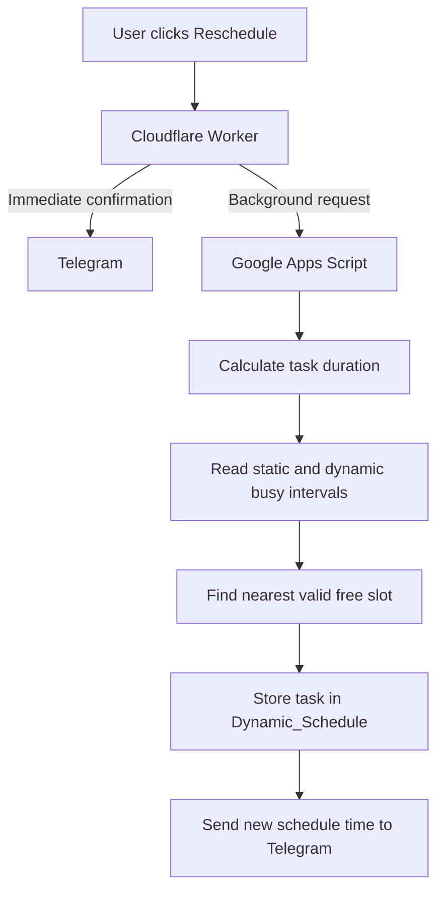

# Telegram Life Tracker

A fast, serverless Telegram productivity and wellbeing tracker powered by **Cloudflare Workers**, **Google Apps Script**, and **Google Sheets**.

The project turns a weekly schedule spreadsheet into an interactive Telegram assistant. It sends each upcoming task approximately one hour before it begins, records task status, captures energy levels, produces daily and weekly analytics, and builds an hourly energy heatmap.

## Why this architecture?

A first version built entirely with Google Apps Script worked, but Telegram button responses could feel slow because Apps Script may cold-start and each click may read or write a spreadsheet before Telegram receives confirmation.

This version separates responsibilities:


- **Cloudflare Worker** handles Telegram webhooks and acknowledges button clicks immediately.
- **Google Apps Script** handles spreadsheet operations, analytics, scheduled reminders, reports, and heatmap generation.
- **Google Sheets** stores the schedule, actions, reminder history, energy logs, reports, and heatmap.
- No VPS is required.
- The user's computer does not need to remain online after deployment.

## Features

- Sends each task approximately one hour before its scheduled start time
- Sends tasks individually instead of grouping several tasks together
- Checks the schedule every five minutes
- Prevents duplicate reminders using `Reminder_Log`
- Inline actions: Done, Skip, Start, Pause, Later 30m, and Smart Reschedule
- Direct energy buttons from 1 to 5
- Fast Telegram feedback before spreadsheet work begins
- Daily and seven-day analytics
- Productive-time calculation
- Completion-rate calculation
- Best work category
- Best energy hour
- Hour-by-hour energy heatmap
- Friday-night weekly report
- Duplicate Done and Skip protection
- Shared-secret authentication between Worker and Apps Script
- Cloudflare Secrets and Apps Script Properties instead of committed credentials
- Automatic task-cell status colors
- Serverless operation without a VPS
- Smart dynamic rescheduling to the nearest available free time
- Searches future availability without modifying the weekly schedule template
- Stores rescheduled tasks in `Dynamic_Schedule`

## How task reminders work

Google Apps Script checks the schedule every five minutes.

For every task, it calculates whether the task will start approximately one hour later.

```text
Current time
    ↓
Add 60 minutes
    ↓
Find tasks starting within the reminder window
    ↓
Check Reminder_Log
    ↓
Send only tasks that have not already been sent
```

Because Apps Script time-based triggers are not guaranteed to run at an exact second, the default reminder window is:

```text
55 to 65 minutes before the task starts
```

For example:

| Task start | Expected reminder |
|---|---|
| 09:00 | Approximately 08:00 |
| 13:30 | Approximately 12:30 |
| 18:00 | Approximately 17:00 |

Each task is sent only once per day.

The previous four-hour grouped-reminder model is not used in the current version.


## Smart dynamic rescheduling

PulseTask can automatically move a task to the nearest available free time.

This is useful when an unexpected event, phone call, meeting, or interruption prevents the user from completing the current task.

Each Telegram task card includes:

```text
🔄 Reschedule to Free Time
```

The smart rescheduling workflow is:



The system:

1. Calculates the original task duration.
2. Reads the weekly schedule for the selected date.
3. Reads active tasks from `Dynamic_Schedule`.
4. Excludes the task currently being moved.
5. Adds a configurable buffer around busy intervals.
6. Searches for the nearest available slot.
7. Checks free time after the final task of the day.
8. Searches future days if no valid slot exists today.
9. Stores the new task as a dynamic override.
10. Sends a confirmation message with the new time.

Example response:

```text
✅ Task Rescheduled

📌 Prepare Elevator Pitch
▪️ Category: Deep Work

Previous: 2026-07-02, 14:00–15:00
New: Today, 17:05–18:05

A new reminder will be sent one hour before the rescheduled task.
```

### Rescheduling configuration

The main Apps Script configuration includes:

```javascript
RESCHEDULE_DAY_START: '06:00',
RESCHEDULE_DAY_END: '23:00',
RESCHEDULE_BUFFER_MINUTES: 5,
RESCHEDULE_STEP_MINUTES: 5,
RESCHEDULE_SEARCH_DAYS: 7
```

Meaning:

| Setting | Purpose |
|---|---|
| `RESCHEDULE_DAY_START` | Earliest allowed rescheduled start time |
| `RESCHEDULE_DAY_END` | Latest allowed end-of-day search boundary |
| `RESCHEDULE_BUFFER_MINUTES` | Buffer before and after busy tasks |
| `RESCHEDULE_STEP_MINUTES` | Time rounding interval |
| `RESCHEDULE_SEARCH_DAYS` | Number of future days to search |

The weekly schedule template is never modified by this feature.

Instead, rescheduled tasks are stored in:

```text
Dynamic_Schedule
```

When PulseTask checks reminders, it combines:

```text
Weekly schedule
+
Active Dynamic_Schedule tasks
-
Static tasks overridden by a reschedule
```

## Repository structure

```text
telegram-life-tracker-cloudflare/
├── README.md
├── LICENSE
├── CONTRIBUTING.md
├── SECURITY.md
├── .gitignore
├── apps-script/
│   ├── Code.gs
│   └── appsscript.json
├── cloudflare-worker/
│   ├── package.json
│   ├── wrangler.jsonc
│   ├── .dev.vars.example
│   └── src/
│       └── index.js
├── docs/
│   ├── ARCHITECTURE.md
│   ├── SETUP.md
│   ├── GOOGLE_SHEETS_SCHEMA.md
│   ├── OPERATIONS.md
│   ├── TESTING.md
│   ├── TROUBLESHOOTING.md
│   ├── SECURITY_GUIDE.md
│   ├── DEVELOPMENT.md
│   ├── ROADMAP.md
│   └── MASTER_PROMPT.md
├── examples/
│   ├── sample_schedule.csv
│   └── powershell_commands.md
└── .github/
    └── ISSUE_TEMPLATE/
```

## Prerequisites

- A Google account
- A Telegram account
- A Telegram bot created through `@BotFather`
- A Cloudflare account
- Node.js 22 or newer
- npm
- A Google Sheet containing the required schedule columns
- PowerShell, Terminal, or another command-line environment

## Main schedule schema

The first row of the main sheet must include these exact headers:

```text
Start | Finish | Time Duration | State | Saturday | Sunday | Monday | Tuesday | Wednesday | Thursday | Friday
```

Example:

| Start | Finish | Time Duration | State | Monday | Tuesday |
|---|---|---|---|---|---|
| 06:30 | 08:30 | 02:00 | Health/GYM | Gym | Gym |
| 09:00 | 11:00 | 02:00 | Deep Work | Product design | Research |
| 13:00 | 14:00 | 01:00 | Learning | Read a paper | Online course |

The following values are ignored:

```text
Blank cells
-
—
N/A
NA
null
undefined
```

Supported time formats include:

```text
06:30
6:30
17:30
6:30 AM
11:30 PM
```

Tasks crossing midnight are also supported:

```text
23:30 → 05:30
```

## Generated sheets

Apps Script automatically creates and manages:

- `Action_Log`
- `Mood_Log`
- `Reminder_Log`
- `Dynamic_Schedule`
- `Weekly_Report`
- `Energy_Heatmap`

### Action_Log

Stores task interactions:

```text
Pending
Done
Skipped
Started
Paused
Later 30m
Energy 1/5
Energy 2/5
Energy 3/5
Energy 4/5
Energy 5/5
```

### Mood_Log

Stores:

- Energy level
- Mood label
- Task
- Category
- Date
- Hour
- Source

### Reminder_Log

Stores every successfully sent task reminder.

It prevents the same task from being sent repeatedly when the five-minute trigger runs again.

Example columns:

```text
Sent At
Reminder Date
Day
Row Number
Start
Task
```


### Dynamic_Schedule

Stores all tasks that were moved by the smart rescheduling engine.

The original weekly schedule remains unchanged. A rescheduled task is stored as a dynamic override with its own unique task reference.

Example columns:

```text
Dynamic ID
Created At
Original Date
Schedule Date
Original Row
Original Start
Original Finish
Previous Task Ref
New Start
New Finish
State
Status
Task
Reason
Reschedule Count
```

Possible statuses include:

```text
Active
Completed
Skipped
Superseded
```

A dynamic task reference looks like:

```text
D20260702-R12-V1
```

A static schedule task reference looks like:

```text
S12
```

### Weekly_Report

Stores calculated weekly performance metrics.

### Energy_Heatmap

Displays average hourly energy levels for the last seven days.

## Quick start

For more detailed instructions, see:

```text
docs/SETUP.md
```

## 1. Create a Telegram bot with BotFather

Telegram bots must be created through the official Telegram bot-management account:

```text
@BotFather
```

### Create the bot

1. Open Telegram.
2. Search for `@BotFather`.
3. Confirm that the account is the official verified BotFather.
4. Open the conversation.
5. Send:

```text
/start
```

6. Send:

```text
/newbot
```

7. BotFather asks for a display name.

Example:

```text
PulseTask
```

8. BotFather asks for a username.

The username must end with `bot`.

Examples:

```text
PulseTaskBot
pouya_pulse_task_bot
my_life_tracker_bot
```

9. BotFather returns a token similar to:

```text
1234567890:AAExampleTokenValue
```

This is your:

```text
TELEGRAM_BOT_TOKEN
```

Never publish or commit this token.

### Start your new bot

Open the newly created bot and send:

```text
/start
```

This is necessary before the bot can send messages to your personal chat.

### Optional BotFather configuration

You can configure the bot using these BotFather commands:

```text
/setdescription
/setabouttext
/setuserpic
/setcommands
```

Recommended bot commands:

```text
start - Show bot help
test - Send test buttons
today - Generate today's report
week - Generate the weekly report
heatmap - Update the energy heatmap
```

### Revoke an exposed token

If the bot token is ever pasted publicly, committed to GitHub, included in a screenshot, or shared accidentally:

1. Open `@BotFather`.
2. Send:

```text
/revoke
```

3. Select the affected bot.
4. Generate a new token.
5. Update the Cloudflare secret.
6. Redeploy the Worker.

Never continue using an exposed token.

## 2. Retrieve your Telegram chat ID

Before setting the Telegram webhook, send `/start` to your bot.

Then run:

```powershell
$BOT_TOKEN = "YOUR_TELEGRAM_BOT_TOKEN"

Invoke-RestMethod `
  -Uri "https://api.telegram.org/bot$BOT_TOKEN/getUpdates"
```

Look for:

```text
message
  chat
    id
```

Example:

```json
{
  "message": {
    "chat": {
      "id": 123456789
    }
  }
}
```

The numeric value is your:

```text
TELEGRAM_CHAT_ID
```

For a personal bot, this value is usually a positive integer.

## 3. Prepare the Google Sheet

Create a Google Sheet and add the required schedule headers:

```text
Start
Finish
Time Duration
State
Saturday
Sunday
Monday
Tuesday
Wednesday
Thursday
Friday
```

Add your weekly tasks below the header row.

Open:

```text
Extensions → Apps Script
```

Replace the default Apps Script code with the contents of:

```text
apps-script/Code.gs
```

Save the project.

## 4. Configure the Apps Script project timezone

Open:

```text
Apps Script
→ Project Settings
→ Time zone
```

Choose the timezone matching the schedule.

Example:

```text
Asia/Tehran
```

The Apps Script project timezone and configured application timezone should match.

## 5. Configure Apps Script properties

Open:

```text
Apps Script
→ Project Settings
→ Script Properties
```

Create the following properties:

| Property | Value |
|---|---|
| `TELEGRAM_BOT_TOKEN` | Token received from BotFather |
| `TELEGRAM_CHAT_ID` | Numeric personal Telegram chat ID |
| `WORKER_API_SECRET` | A long random shared secret |
| `MAIN_SHEET_NAME` | Usually `Sheet1` or `Schedule` |
| `TIMEZONE` | Example: `Asia/Tehran` |

Example shared secret format:

```text
pulse-task-2026-7Kx9Qm2Vf4Nz8Rp1
```

The value does not come from Telegram or Cloudflare. You create it yourself.

It must be:

- Long
- Random
- Private
- Identical in Apps Script and Cloudflare

Do not place a real secret in source code committed to GitHub.

## 6. Authorize Apps Script

Before deployment, run one test function manually from the Apps Script editor:

```javascript
testTelegram
```

Google may ask you to authorize access to:

- Google Sheets
- External network requests
- Apps Script triggers

Complete the authorization process using the Google account that owns the spreadsheet.

## 7. Deploy Apps Script as a Web App

Open:

```text
Deploy
→ New deployment
→ Web app
```

Configure:

```text
Execute as: Me
Who has access: Anyone
```

Click Deploy.

Copy the generated URL ending in:

```text
/exec
```

Example:

```text
https://script.google.com/macros/s/DEPLOYMENT_ID/exec
```

Do not use the `/dev` URL.

The `/exec` URL becomes:

```text
APPS_SCRIPT_URL
```

After changing Apps Script code:

```text
Deploy
→ Manage deployments
→ Edit
→ New version
→ Deploy
```

## 8. Install the Cloudflare Worker

Open a terminal and enter the Worker directory:

```powershell
cd cloudflare-worker
```

Install dependencies:

```powershell
npm install
```

Authenticate Wrangler:

```powershell
npx wrangler login
```

## 9. Configure Cloudflare secrets

Run each command separately:

```powershell
npx wrangler secret put TELEGRAM_BOT_TOKEN
```

Paste the token received from BotFather.

```powershell
npx wrangler secret put TELEGRAM_CHAT_ID
```

Paste the numeric Telegram chat ID.

```powershell
npx wrangler secret put APPS_SCRIPT_URL
```

Paste the Apps Script `/exec` URL.

```powershell
npx wrangler secret put WORKER_API_SECRET
```

Paste the same shared secret configured in Apps Script.

Required Worker secrets:

```text
TELEGRAM_BOT_TOKEN
TELEGRAM_CHAT_ID
APPS_SCRIPT_URL
WORKER_API_SECRET
```

## 10. Deploy the Cloudflare Worker

Run:

```powershell
npx wrangler deploy
```

Wrangler returns a Worker URL similar to:

```text
https://telegram-life-tracker.YOUR-SUBDOMAIN.workers.dev
```

Save this URL.

You can test its health endpoint by opening it in a browser.

Expected response:

```json
{
  "ok": true,
  "service": "Telegram Life Tracker Worker"
}
```

## 11. Point the Telegram webhook to Cloudflare Worker

The Telegram webhook must point only to the Cloudflare Worker.

It must not point directly to Apps Script.

In PowerShell:

```powershell
$BOT_TOKEN = "YOUR_TELEGRAM_BOT_TOKEN"
$WORKER_URL = "https://YOUR-WORKER.YOUR-SUBDOMAIN.workers.dev"

Invoke-RestMethod `
  -Uri "https://api.telegram.org/bot$BOT_TOKEN/setWebhook" `
  -Method Post `
  -ContentType "application/json" `
  -Body (@{
    url = $WORKER_URL
    drop_pending_updates = $true
  } | ConvertTo-Json)
```

Expected result:

```text
ok          : True
result      : True
description : Webhook was set
```

Verify the webhook:

```powershell
Invoke-RestMethod `
  -Uri "https://api.telegram.org/bot$BOT_TOKEN/getWebhookInfo"
```

The returned URL must match the Cloudflare Worker URL.

## 12. Install Apps Script triggers

From the Apps Script editor, select and run:

```javascript
installProjectTriggers
```

Run it only once during initial setup or after changing trigger configuration.

It creates:

```text
checkUpcomingTaskReminders
→ Every 5 minutes

sendWeeklyWellbeingReport
→ Every Friday around 23:45
```

The reminder trigger checks whether any task begins approximately one hour later.

It does not send multiple upcoming tasks as a four-hour bundle.

The old trigger below must not remain active:

```text
sendNext4HoursPlanToTelegram
```

The installation function removes old project triggers before creating the current ones.

You can also verify triggers manually:

```text
Apps Script
→ Triggers
```

## 13. Test the one-hour reminder

To test without waiting until a task is exactly one hour away, run:

```javascript
testNextUpcomingReminder
```

This sends the nearest upcoming task for the current day immediately.

To test the real reminder timing conditions, run:

```javascript
testReminderChecker
```

This sends a message only when a task begins within the configured reminder window.

Default configuration:

```text
Reminder time: 60 minutes before task
Reminder window: ±5 minutes
Trigger frequency: every 5 minutes
```

## 14. Test Telegram commands

Send these commands to your bot:

```text
/start
/test
/today
/week
/heatmap
```

Expected behavior:

| Command | Result |
|---|---|
| `/start` | Shows help and available commands |
| `/test` | Sends a test task card |
| `/today` | Generates today's analytics report |
| `/week` | Generates the last seven days report |
| `/heatmap` | Rebuilds the seven-day energy heatmap |

Change `TEST_ROW` in:

```text
cloudflare-worker/src/index.js
```

if the default test row has no task for the current day.

## Task reminder buttons

Each reminder contains:

```text
✅ Done
⏭ Skip
⏱ Start
⏸ Pause
🔁 Later
🔄 Reschedule to Free Time
🔥1
🔥2
🔥3
🔥4
🔥5
📊 Today
📈 Week
🟩 Heatmap
```

Example callback data:

```text
done:12
skip:12
start:12
pause:12
later30:S12
reschedule:S12
energyval:S12:4
report:today
report:week
report:heatmap
```

## Task status colors

The current weekday task cell changes color:

| Status | Color |
|---|---|
| Pending | Light red |
| Done | Light green |
| Skipped | Light orange |
| Started | Light blue |
| Paused | Light purple |
| Default | White |

Recommended colors:

```text
Done     #b7e1cd
Pending  #f4c7c3
Skipped  #fce8b2
Started  #cfe2f3
Paused   #d9d2e9
Default  #ffffff
```

## Security model

Two separate secret stores are used.

### Cloudflare Secrets

```text
TELEGRAM_BOT_TOKEN
TELEGRAM_CHAT_ID
APPS_SCRIPT_URL
WORKER_API_SECRET
```

### Apps Script Properties

```text
TELEGRAM_BOT_TOKEN
TELEGRAM_CHAT_ID
WORKER_API_SECRET
MAIN_SHEET_NAME
TIMEZONE
```

The shared secret authenticates Worker-to-Apps-Script requests.

The Worker also rejects Telegram updates from chat IDs other than the configured user.

Never store real secrets in:

```text
README.md
wrangler.jsonc
source code
Git commits
screenshots
issue reports
.dev.vars.example
```

## Analytics

### Completion rate

```text
Done tasks / Pending reminders sent × 100
```

### Productive time

The sum of planned durations for tasks marked Done.

### Average energy

The arithmetic mean of all energy values logged during the selected period.

### Best work category

The category with the highest total planned duration among completed tasks.

### Best energy hour

The date-and-hour bucket with the highest average recorded energy value.

## Daily report example

```text
📊 Today's Report
🗓 Period: 2026-07-02 to 2026-07-02

✅ Done: 2
⏭ Skipped: 0
⏳ Reminders Sent: 5
⏱ Started: 1
⏸ Paused: 0
🔁 Postponed: 0

🎯 Completion Rate: 40%
⏱ Productive Time: 2h 15m
🔥 Average Energy: 2/5

🏆 Best Performing Category:
Health/GYM — 2h

🟩 Best Energy Time:
2026-07-02 06:00 — Energy 2/5
```

## Energy heatmap

Energy values use the following scale:

| Energy | Meaning |
|---|---|
| 1 | Very Low |
| 2 | Low |
| 3 | Medium |
| 4 | Good |
| 5 | High |

Heatmap colors:

| Value | Color |
|---|---|
| Empty | White |
| 1 | Red |
| 2 | Orange |
| 3 | Yellow |
| 4 | Light green |
| 5 | Green |


## Initialize the complete system

Apps Script functions are executed individually. The full project is initialized by running:

```javascript
initializePulseTask
```

This function:

- Validates required configuration values
- Verifies the main schedule sheet
- Checks required schedule headers
- Creates missing generated sheets
- Preserves existing logs and schedule data
- Installs the reminder and weekly-report triggers
- Builds the initial seven-day heatmap
- Sends a successful initialization message to Telegram

Run it from:

```text
Apps Script
→ Select function: initializePulseTask
→ Run
```

For a completely clean start:

```text
1. Run fullResetSystem
2. Run initializePulseTask
3. Run testNextUpcomingReminder
4. Send /test in Telegram
5. Test Smart Reschedule
```

`fullResetSystem` deletes and recreates generated system sheets and resets task colors, but it does not delete the weekly schedule.

Generated sheets:

```text
Action_Log
Mood_Log
Reminder_Log
Dynamic_Schedule
Weekly_Report
Energy_Heatmap
```

## Operational notes

- Telegram webhook must point only to the Cloudflare Worker.
- Apps Script is an authenticated backend endpoint, not the Telegram webhook.
- Apps Script sends scheduled reminders and generated reports.
- Cloudflare Worker handles interactive Telegram commands and buttons.
- Button confirmation happens before spreadsheet processing.
- `ctx.waitUntil()` allows spreadsheet operations to continue in the background.
- After changing Apps Script code, deploy a new Apps Script Web App version.
- After changing Worker code or Cloudflare secrets, run:

```powershell
npx wrangler deploy
```

- The user's computer may remain off after deployment.
- Cloudflare Worker, Telegram, Apps Script, and Google Sheets continue operating in the cloud.

## Troubleshooting

### Start Worker live logs

```powershell
npx wrangler tail
```

Then click a Telegram button or send a command.

### Check Telegram webhook

```powershell
Invoke-RestMethod `
  -Uri "https://api.telegram.org/bot$BOT_TOKEN/getWebhookInfo"
```

### Test Apps Script health endpoint

Open the Apps Script `/exec` URL in a browser.

Expected response:

```json
{
  "ok": true,
  "service": "PulseTask Apps Script API"
}
```

### Reminder is not sent

Check:

- The trigger `checkUpcomingTaskReminders` exists.
- The trigger runs every five minutes.
- The project timezone is correct.
- The schedule weekday header is correct.
- The task start time is valid.
- The current task was not already recorded in `Reminder_Log`.
- The task begins within approximately 55 to 65 minutes.

Run:

```javascript
testNextUpcomingReminder
```

to verify Telegram delivery without waiting.

### Reminder is sent repeatedly

Check that:

- `Reminder_Log` exists.
- The reminder row is successfully added after sending.
- The same schedule row and start time are not duplicated.
- Only one reminder trigger exists.


### Smart Reschedule reports no suitable free time

Check:

- `RESCHEDULE_DAY_END` is late enough
- `RESCHEDULE_SEARCH_DAYS` is greater than zero
- The current task is excluded from the busy interval list
- Free time after the final task of the day is checked
- Dynamic tasks with status `Active` are loaded correctly
- The required duration fits inside the available slot
- Buffer time is not larger than the available gap

Recommended defaults:

```javascript
RESCHEDULE_DAY_START: '06:00',
RESCHEDULE_DAY_END: '23:00',
RESCHEDULE_BUFFER_MINUTES: 5,
RESCHEDULE_STEP_MINUTES: 5,
RESCHEDULE_SEARCH_DAYS: 7
```

To test directly from Apps Script:

```javascript
testSmartReschedule
```

To test from Telegram:

```text
/test
→ Click Reschedule to Free Time
```

### Telegram buttons are slow

Check that:

- The Telegram webhook points to Cloudflare Worker.
- `answerCallbackQuery` is called before Apps Script processing.
- Spreadsheet processing is running through `ctx.waitUntil()`.
- Telegram webhook does not point directly to Apps Script.

### Apps Script returns HTML instead of JSON

Possible causes:

- The `/dev` URL was used.
- Deployment access is incorrect.
- A login page was returned.

Use:

```text
Execute as: Me
Who has access: Anyone
```

and use the URL ending in `/exec`.

### Worker reports missing environment variables

Confirm these Cloudflare secrets exist:

```text
TELEGRAM_BOT_TOKEN
TELEGRAM_CHAT_ID
APPS_SCRIPT_URL
WORKER_API_SECRET
```

### Bot does not respond

Check:

1. You sent `/start` to the new bot.
2. The bot token is current.
3. The bot token was not revoked.
4. The webhook points to the deployed Worker.
5. The configured chat ID is correct.
6. Worker logs do not contain Telegram API errors.

See:

```text
docs/TROUBLESHOOTING.md
```

for additional cases.

## Open-source readiness checklist

Before publishing the repository:

- Revoke any token that has ever been pasted publicly
- Confirm no token exists in Git history
- Confirm `.dev.vars` is ignored
- Confirm only placeholders exist in examples
- Remove personal chat IDs
- Remove personal deployment URLs
- Replace personal names in screenshots
- Remove Apps Script deployment IDs from screenshots
- Verify `.gitignore`
- Check Worker logs before sharing screenshots
- Confirm the repository contains no real shared secret
- Confirm `Dynamic_Schedule` contains no private task data before publishing screenshots

## License

MIT License. See [LICENSE](LICENSE).
