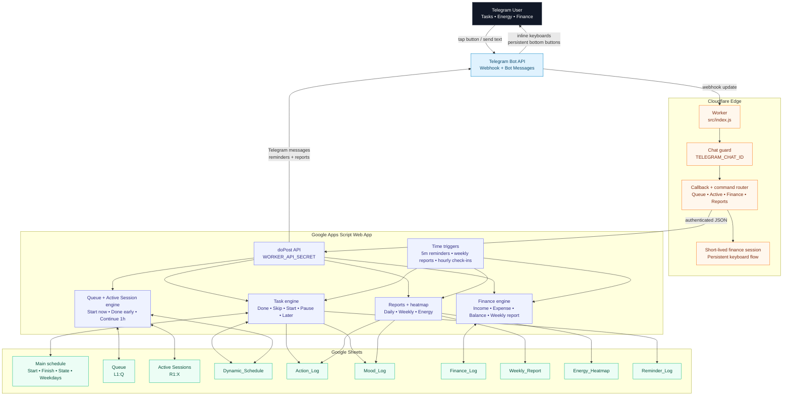

# PulseTask

**Run your day from Telegram. Your Google Sheet does the remembering.**

[](LICENSE)
[](https://workers.cloudflare.com/)
[](https://developers.google.com/apps-script)
[](https://core.telegram.org/bots)

PulseTask turns a Google Sheet schedule into a Telegram assistant that reminds you before tasks start, logs what actually happened, tracks your energy, and records what you spent — all with tap-button replies, no app to install and no server to babysit.

No VPS. No database. No always-on local machine. Just Telegram + a Google Sheet you already own, wired together by a Cloudflare Worker and a Google Apps Script deployment. Built as a single-user personal edition: one chat, one sheet.

## See it in action

A typical evening, entirely from the Telegram chat:

```text
PulseTask  17:32
⏰ Reminder: "Deep Work — Weekly review" starts in 1 hour (18:30-20:00)

You  18:31
/add 90m | Development | Fix finance reply bug

PulseTask  18:31
📝 Add to schedule now?
   Development | Fix finance reply bug | 90m
   [ ➕ Add & Start ]  [ 📥 Add to Queue ]  [ ✖ Cancel ]

You         (taps) ➕ Add & Start

PulseTask  18:31
▶️ Started. Ends ~20:01.
   [ ✅ Done ]  [ ⏸ Pause ]  [ ⏭ Continue 1h ]

You         (taps) ✅ Done

PulseTask  18:31
🔋 How's your energy right now? (1-5)

You         (taps) 4

PulseTask  20:05
💰 Finance
   [ 💸 Add Expense ]  [ 💵 Add Income ]

You         (taps) 💸 Add Expense → 250000 → Food → "groceries" → Save

PulseTask  20:05
✅ Logged -250,000 (Food). Balance: 4,750,000
```

Every message above updates the same Google Sheet: `Action_Log`, `Mood_Log`, and `Finance_Log` fill in automatically, and the weekly report and energy heatmap are built from that data.

## Quick Start

Full walkthrough is in [Setup](#setup) below and [docs/SETUP.md](docs/SETUP.md); this is the short version once you have a Telegram bot token, a Google Sheet, and a Cloudflare account:

```powershell
# 1. Google Sheet: Extensions → Apps Script → paste apps-script/Code.gs,
#    add the Script Properties (bot token, chat ID, shared secret), then run once:
initializePulseTask()

# 2. Deploy the Apps Script project as a Web App and copy the /exec URL

# 3. Cloudflare Worker: point it at that URL
cd cloudflare-worker
npm install
npx wrangler login
npx wrangler secret put TELEGRAM_BOT_TOKEN
npx wrangler secret put TELEGRAM_CHAT_ID
npx wrangler secret put APPS_SCRIPT_URL
npx wrangler secret put WORKER_API_SECRET
npm run deploy

# 4. Point the Telegram webhook at your deployed Worker, then in Telegram:
#    /start
```

That's it — the persistent keyboard (`➕ Add Task`, `📥 Queue`, `▶️ Active`, `💰 Finance`) appears and PulseTask starts sending reminders on your schedule.

## Why PulseTask

- **One source of truth you already own** — everything lives in your Google Sheet, readable and editable without PulseTask.
- **Zero always-on infrastructure** — Cloudflare Worker + Apps Script are both request-driven; nothing runs (or costs money) while you're not using it.
- **Tap, don't type** — inline buttons and a persistent keyboard drive tasks, queue, active sessions, and finance; typed commands are there when you want them.
- **Reminders that don't need you online** — Apps Script time triggers send reminders and weekly reports even if the Worker never receives a webhook call that day.
- **Credentials never touch source control** — secrets live in Cloudflare Secrets and Apps Script Properties, not in the repo. See [Security](#security).

## Roadmap

PulseTask v1 (current) is a working single-user system. See [docs/ROADMAP.md](docs/ROADMAP.md) for the full list; near-term direction:

| Version | Focus |
|---|---|
| v1 (current) | Single-user Telegram bot, Cloudflare webhook, Apps Script backend, daily/weekly reports, energy heatmap |
| v1.1 | Idempotency for duplicate background requests, better Start/Pause duration tracking, configurable report schedule, localized messages |
| v2 | Cloudflare D1 event store, multi-user onboarding, per-user Sheet connections, web dashboard |

## What it does

- Sends Telegram reminders about one hour before scheduled tasks.
- Tracks `Done`, `Skip`, `Start`, `Pause`, `Later`, energy, and smart reschedule actions.
- Adds unplanned Telegram tasks with preview and confirmation.
- Keeps unscheduled Telegram work in a visible Google Sheets Queue.
- Starts Queue tasks into one-hour Active Sessions with `Done` / `Continue 1h` controls.
- Records actual time, session time, planned time, and unplanned work.
- Builds daily and weekly productivity summaries.
- Records 1-5 energy levels and generates a seven-day hourly heatmap.
- Logs expenses and income from Telegram into a dedicated `Finance_Log` sheet.
- Tracks current finance balance and weekly spending by category.
- Keeps credentials out of source code through Apps Script Properties and Cloudflare Secrets.

## Architecture



| Layer | Role |
|---|---|
| Telegram | Chat UI, persistent buttons, inline actions, finance/task flows |
| Cloudflare Worker | Webhook endpoint, chat authorization, callback parsing, fast Telegram responses |
| Google Apps Script | Schedule logic, task state, finance state, reports, triggers, Google Sheets writes |
| Google Sheets | Main plan, queue, active sessions, dynamic schedule, logs, reports |

### Technology architecture

| Technology | Where it lives | Why it is used |
|---|---|---|
| Telegram Bot API | External chat interface | Low-friction personal UI with persistent buttons and inline actions |
| Cloudflare Worker | `cloudflare-worker/src/index.js` | Public webhook endpoint, fast callback acknowledgement, chat authorization, and lightweight session routing |
| Google Apps Script Web App | `apps-script/Code.gs` | Trusted automation layer with direct access to Google Sheets, triggers, and UrlFetchApp |
| Google Sheets | User-owned spreadsheet | Human-readable storage for schedule, Queue, Active Sessions, logs, reports, and finance records |
| Apps Script Triggers | Installed by `initializePulseTask()` | Reminder polling, weekly reports, and one-hour Queue follow-ups |
| Cloudflare Secrets | Worker runtime | Stores Telegram token, chat ID, Apps Script URL, and shared API secret |
| Apps Script Properties | Google runtime | Stores the same bot credentials plus schedule and finance configuration |

The architecture intentionally keeps persistence inside the user-owned Google Sheet. The Worker stays stateless except for short-lived finance wizard state, so it can be redeployed without migrating data.

### Communication model

| Flow | Transport | Authentication | Result |
|---|---|---|---|
| Telegram -> Worker | Telegram webhook POST | Telegram bot token at webhook registration time | Worker receives messages, commands, and callback queries |
| Worker -> Telegram | Telegram Bot API HTTPS calls | `TELEGRAM_BOT_TOKEN` in Cloudflare Secrets | Bot sends messages, inline keyboards, reports, and persistent keyboard updates |
| Worker -> Apps Script | HTTPS POST to `APPS_SCRIPT_URL` | `WORKER_API_SECRET` in every JSON payload | Apps Script mutates Sheets or returns data for Queue, Finance, and reports |
| Apps Script -> Telegram | Telegram Bot API HTTPS calls | `TELEGRAM_BOT_TOKEN` in Apps Script Properties | Time-based reminders and scheduled reports are sent without a user webhook event |
| Apps Script -> Google Sheets | SpreadsheetApp APIs | Script executes as the sheet owner | Logs, dynamic tasks, Queue rows, Active Sessions, reports, and finance rows are written |

Important communication rules:

- Telegram webhook updates should go to Cloudflare, not Apps Script.
- Apps Script `/exec` is public by deployment design, but every POST is rejected unless the shared secret matches.
- The Worker ignores messages from any chat except `TELEGRAM_CHAT_ID`.
- Inline callback queries are acknowledged quickly by the Worker, then heavier work is delegated to Apps Script.
- Time-based jobs are initiated inside Apps Script triggers, so reminders and weekly reports do not depend on the Worker receiving a chat message.

The Telegram webhook points to Cloudflare, not directly to Apps Script. Cloudflare signs every Apps Script request with `WORKER_API_SECRET`.

## Telegram UX

Send `/start` once after deploying the Worker. Telegram installs a persistent bottom keyboard:

```text
➕ Add Task     📥 Queue
▶️ Active       💰 Finance
```

### Add tasks

You can add work from Telegram without editing the sheet manually:

```text
Review PulseTask release
/add Review PulseTask release
/add Development | Improve Telegram finance flow
/add 18:30-20:00 | Research | Read robotics paper
/add 90m | Deep Work | Weekly review
/add now-20:00 | Personal | Clean inbox
```

If no time is provided, PulseTask suggests the nearest available 60-minute slot.

Confirmed tasks can be:

- added to Queue for later;
- added and started immediately;
- cancelled before saving.

### Queue and active work

Tasks saved to Queue stay visible in the main sheet and do not reserve time until you start them.

Use `📥 Queue` or `/queue` to pick pending work. Starting a queued task:

1. creates a one-hour Active Session;
2. starts the timer;
3. removes the item from Queue;
4. sends immediate `Done` and `Continue 1h` controls.

If you finish early, press `Done`. If you need more time, press `Continue 1h`; PulseTask extends the planned finish time and schedules another check-in.

Use `▶️ Active` or `/active` to reopen controls for running Queue tasks.

### Finance flow

Use `💰 Finance` or `/finance`.

The current finance flow is step-by-step:

1. choose `💸 Add Expense` or `💵 Add Income`;
2. type only the amount;
3. choose a category button;
4. optionally add a note, or send `-`;
5. confirm with `Save`.

Expense categories include Food, Transport, Bills, Loan, Rent, Health, Education, Shopping, and Other. Income categories include Salary, Freelance, Gift, Investment, Refund, and Other.

Legacy one-line commands still work:

```text
/expense 250000 | Food | groceries
/expense 1200000 | Loan | car payment
/income 5000000 | Salary | July payment
```

Finance records are written to `Finance_Log`. Set the optional Apps Script property `FINANCE_STARTING_BALANCE` if the balance should start from an existing amount instead of zero.

### Commands

| Command | Result |
|---|---|
| `/start` | Installs the persistent Telegram keyboard |
| `/help` | Shows task examples |
| `/add ...` | Creates a task draft |
| `/queue` | Lists queued tasks |
| `/active` | Lists running Queue tasks |
| `/finance` | Opens finance tools |
| `/expense ...` | Starts or submits an expense |
| `/income ...` | Starts or submits income |
| `/today` | Sends today’s report |
| `/week` | Sends the last seven days report |
| `/heatmap` | Rebuilds the energy heatmap |
| `/test` | Sends a test action card |

## Google Sheets model

The main schedule tab needs these headers in row 1:

```text
Start | Finish | Time Duration | State | Saturday | Sunday | Monday | Tuesday | Wednesday | Thursday | Friday
```

PulseTask creates or maintains these generated sheets:

| Sheet | Purpose |
|---|---|
| `Action_Log` | Task actions, timing, source, status, and completion records |
| `Mood_Log` | Energy ratings and mood labels |
| `Reminder_Log` | Deduplication for sent reminders |
| `Dynamic_Schedule` | Rescheduled, queued, and Telegram-created tasks |
| `Weekly_Report` | Aggregated wellbeing and productivity metrics |
| `Energy_Heatmap` | Seven-day hourly energy grid |
| `Finance_Log` | Income, expenses, categories, notes, and balance after each transaction |

On the main schedule tab, PulseTask also creates:

- Queue section at `L1:Q`
- Active Sessions section at `R1:X`

See [docs/GOOGLE_SHEETS_SCHEMA.md](docs/GOOGLE_SHEETS_SCHEMA.md) for the exact schema.

## Setup

### Prerequisites

- Telegram account and bot token from [@BotFather](https://t.me/BotFather)
- Google account and Google Sheet
- Cloudflare account
- Node.js 20+
- Git and npm

### 1. Create the Telegram bot

Create a bot with BotFather, then send `/start` to the bot once.

Get your chat ID:

```powershell
$BOT_TOKEN = "YOUR_TELEGRAM_BOT_TOKEN"
Invoke-RestMethod -Uri "https://api.telegram.org/bot$BOT_TOKEN/getUpdates"
```

Use `message.chat.id` as `TELEGRAM_CHAT_ID`.

### 2. Install Apps Script

Open your Google Sheet, then:

1. go to **Extensions → Apps Script**;
2. replace the editor contents with [apps-script/Code.gs](apps-script/Code.gs);
3. add Script Properties:

| Property | Value |
|---|---|
| `TELEGRAM_BOT_TOKEN` | Telegram bot token |
| `TELEGRAM_CHAT_ID` | Your private chat ID |
| `WORKER_API_SECRET` | Long shared secret, 32+ characters |
| `MAIN_SHEET_NAME` | Main schedule sheet name, for example `Sheet1` |
| `TIMEZONE` | IANA timezone, for example `Asia/Tehran` |
| `FINANCE_STARTING_BALANCE` | Optional starting balance |

Run:

```javascript
initializePulseTask()
```

This validates configuration, creates missing generated sheets, installs project triggers, and builds the heatmap.

### 3. Deploy Apps Script

Deploy as a Web App:

```text
Execute as: Me
Who has access: Anyone
```

Copy the `/exec` URL. This is the Worker secret `APPS_SCRIPT_URL`.

After every `Code.gs` change, publish a new Web App version from:

```text
Deploy → Manage deployments → Edit → New version → Deploy
```

### 4. Deploy the Cloudflare Worker

```powershell
cd cloudflare-worker
npm install
npx wrangler login
```

Set production secrets:

```powershell
npx wrangler secret put TELEGRAM_BOT_TOKEN
npx wrangler secret put TELEGRAM_CHAT_ID
npx wrangler secret put APPS_SCRIPT_URL
npx wrangler secret put WORKER_API_SECRET
```

`WORKER_API_SECRET` must match the Apps Script property exactly.

Build and deploy:

```powershell
npm run build
npm run deploy
```

The Worker health endpoint should return:

```json
{
  "ok": true,
  "service": "PulseTask Telegram Worker",
  "version": "2.7-persistent-finance-keyboard"
}
```

### 5. Set the Telegram webhook

```powershell
$BOT_TOKEN = "YOUR_TELEGRAM_BOT_TOKEN"
$WORKER_URL = "https://YOUR-WORKER.YOUR-SUBDOMAIN.workers.dev"

Invoke-RestMethod `
  -Uri "https://api.telegram.org/bot$BOT_TOKEN/setWebhook" `
  -Method Post `
  -ContentType "application/json" `
  -Body (@{
    url = $WORKER_URL
    drop_pending_updates = $true
  } | ConvertTo-Json)
```

Verify:

```powershell
Invoke-RestMethod -Uri "https://api.telegram.org/bot$BOT_TOKEN/getWebhookInfo"
```

Then send `/start` in Telegram.

## Development

Worker commands:

| Command | Purpose |
|---|---|
| `npm run dev` | Run Wrangler locally |
| `npm run build` | Dry-run Worker deployment |
| `npm run deploy` | Deploy Worker |
| `npm run tail` | Stream Worker logs |

Apps Script test helpers:

```javascript
runPulseTaskTests()
testTelegram()
testNextUpcomingReminder()
testTodayReport()
testWeeklyReport()
testHeatmap()
```

Recommended release checks:

```powershell
node --check cloudflare-worker/src/index.js
cd cloudflare-worker
npm run build
```

For Apps Script, run `runPulseTaskTests()` in the Apps Script editor.

## Automation

`initializePulseTask()` installs:

- `checkUpcomingTaskReminders` every five minutes;
- `sendWeeklyFinanceReport` every Friday around 23:30;
- `sendWeeklyWellbeingReport` every Friday around 23:45.

Queue tasks create one-time follow-up triggers. `Continue 1h` replaces the follow-up trigger; `Done` clears it.

## Security

- Never commit real bot tokens, chat IDs, Apps Script URLs, or shared secrets.
- Use Apps Script Properties for Google-side credentials.
- Use Wrangler Secrets for Cloudflare production credentials.
- Keep `.dev.vars` local and ignored.
- Rotate leaked Telegram tokens immediately through BotFather.
- Treat the Apps Script `/exec` URL as public; authorization depends on `WORKER_API_SECRET`.

See [SECURITY.md](SECURITY.md) and [docs/SECURITY_GUIDE.md](docs/SECURITY_GUIDE.md).

## Troubleshooting

| Symptom | Check |
|---|---|
| Telegram buttons are missing | Send `/start` once after Worker deployment |
| Buttons show broken emoji text | Redeploy the latest Worker and send `/start` |
| Apps Script returns HTML | Use the deployed `/exec` URL, not `/dev` |
| Apps Script changes do not apply | Create a new Web App version |
| Reminders do not arrive | Check triggers, timezone, weekday headers, task time, and `Reminder_Log` |
| Queue task does not appear busy | That is expected until it is started |
| Finance balance starts at zero | Set `FINANCE_STARTING_BALANCE` |
| Worker errors are unclear | Run `npm run tail` in `cloudflare-worker` |

## Repository structure

```text
PulseTask/
├── apps-script/
│   ├── Code.gs
│   └── appsscript.json
├── cloudflare-worker/
│   ├── src/index.js
│   ├── package.json
│   ├── wrangler.jsonc
│   └── .dev.vars.example
├── docs/
├── examples/
├── CONTRIBUTING.md
├── SECURITY.md
└── README.md
```

Useful docs:

- [docs/ARCHITECTURE.md](docs/ARCHITECTURE.md)
- [docs/SETUP.md](docs/SETUP.md)
- [docs/GOOGLE_SHEETS_SCHEMA.md](docs/GOOGLE_SHEETS_SCHEMA.md)
- [docs/OPERATIONS.md](docs/OPERATIONS.md)
- [docs/TROUBLESHOOTING.md](docs/TROUBLESHOOTING.md)
- [docs/ROADMAP.md](docs/ROADMAP.md)

## Scope

PulseTask is currently a personal single-user system. It does not include multi-user onboarding, OAuth account linking, hosted billing, a public dashboard, or a production database. Those are future product directions, not required for the personal edition.

## License

PulseTask is released under the [MIT License](LICENSE).
