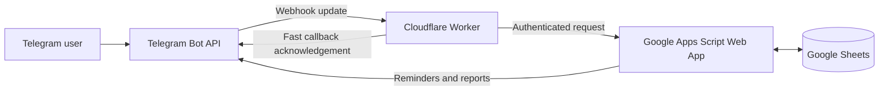
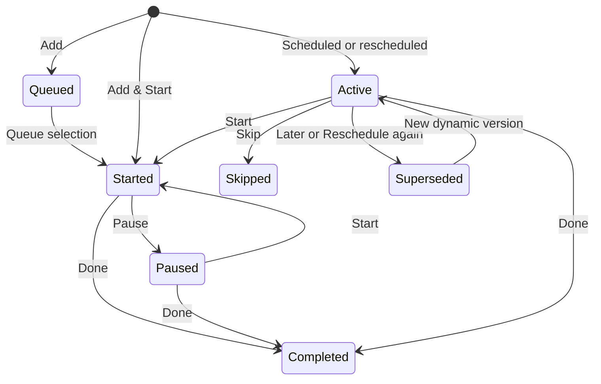

# PulseTask

[](LICENSE)
[](https://workers.cloudflare.com/)
[](https://developers.google.com/apps-script)

**A serverless personal productivity assistant powered by Telegram, Google Sheets, Google Apps Script, and Cloudflare Workers.**

PulseTask turns a weekly Google Sheets schedule into an interactive Telegram workflow. It sends reminders, tracks task status and actual time, records energy levels, finds conflict-free time slots, and produces daily and weekly insights—without a VPS, paid database, or always-on computer.

> PulseTask is currently a single-user personal edition. Access is restricted to one configured Telegram chat ID.

## Highlights

- ⏰ Sends reminders approximately one hour before scheduled tasks
- ➕ Provides a persistent **Add Task** button—no `/add` command required
- 📝 Creates a preview before saving an unplanned Telegram task
- ✅ Removes completed draft cards from the chat after **Add**, **Add & Start**, or **Cancel**
- 📥 Keeps unstarted Telegram tasks in a **Queue** at `L1` and lets you pick one to start from Telegram
- ⏳ Writes selected Queue work into **Active Sessions** on `Time/Plan` and checks in every hour
- 🎯 Supports Done, Skip, Start, Pause, Later, and smart Reschedule actions
- 🔄 Finds the nearest conflict-free slot across the next seven days
- 🔥 Records energy from 1–5 and builds a seven-day hourly heatmap
- 📊 Generates today and seven-day performance reports
- ⏱ Tracks planned, session, actual, and unplanned time
- 🧠 Identifies the most productive category and best energy period
- 🎨 Colors schedule cells by task status
- 🔐 Keeps credentials in Apps Script Properties and Cloudflare Secrets

## Architecture



| Component | Responsibility |
|---|---|
| Telegram | User interface, commands, inline actions, and persistent Add Task and Queue buttons |
| Cloudflare Worker | Webhook handling, chat authorization, callback parsing, and fast acknowledgements |
| Google Apps Script | Scheduling logic, task state, reports, triggers, and Telegram delivery |
| Google Sheets | Weekly plan, dynamic schedule, logs, reports, and energy heatmap |

The Telegram webhook points to Cloudflare—not directly to Apps Script. Worker-to-Apps-Script requests are authenticated with a shared `WORKER_API_SECRET`.

## Telegram experience

Send `/start` once to install the persistent **➕ Add Task** and **📥 Queue** buttons below the chat. Add new work normally, or open Queue whenever your schedule is empty and pick a pending task to start.

- **Add** — save the task
- **Add & Start** — save it and start timing immediately
- **Cancel** — discard the draft

After a successful action, the draft card is deleted to keep the chat clean. If saving fails, it stays visible so the action can be retried.

Tasks saved with **Add** are placed in the Queue with status `Queued`, so they do not reserve time or push later slot suggestions forward. Press **📥 Queue** (or send `/queue`) to see every pending Queue task, then select the one you want to do now. PulseTask creates a one-hour block in the **Active Sessions** area of the same `Time/Plan` sheet, starts its timer, and removes it from Queue. After one hour Telegram asks whether the task is **Done** or should **Continue 1h**. Continuing extends the sheet's Finish time and schedules the next hourly check-in. Tasks saved with **Add & Start** begin immediately and never enter the Queue.

Plain text also creates a task draft. Supported input formats include:

```text
Review the PulseTask changes
/add Review the PulseTask changes
/add Development | Improve Telegram integration
/add 18:30-20:00 | Research | Read a robotics paper
/add 90m | Deep Work | Prepare the weekly report
/add now-20:00 | Personal | Update my schedule
```

When no time is supplied, PulseTask suggests the nearest available 60-minute slot.

### Commands

| Command | Result |
|---|---|
| `/start` | Opens PulseTask and installs the persistent Add Task and Queue buttons |
| `/queue` | Lists pending Queue tasks so you can start one immediately |
| `/help` | Shows task-input examples |
| `/add ...` | Creates an unplanned task draft |
| `/today` | Generates today's report |
| `/week` | Generates the last seven days report |
| `/heatmap` | Rebuilds the energy heatmap |
| `/test` | Sends a test task card for the configured test row |

Task reminder cards include:

```text
✅ Done        ⏭ Skip
⏱ Start       ⏸ Pause       🔁 Later
🔄 Reschedule to Free Time
🔥1  🔥2  🔥3  🔥4  🔥5
📊 Today       📈 Week       🟩 Heatmap
```

## Quick start

### Prerequisites

- A Telegram account
- A Google account and Google Sheet
- A free Cloudflare account
- Node.js 20 or newer
- Git and npm

### 1. Create the Telegram bot

Open [@BotFather](https://t.me/BotFather), run `/newbot`, and save the generated bot token. Send `/start` to the new bot before continuing.

Before setting a webhook, obtain your numeric chat ID:

```powershell
$BOT_TOKEN = "YOUR_TELEGRAM_BOT_TOKEN"
Invoke-RestMethod -Uri "https://api.telegram.org/bot$BOT_TOKEN/getUpdates"
```

Read `message.chat.id` from the response.

### 2. Create the schedule sheet

Create a Google Sheet. The first row of the main schedule tab must contain these exact headers:

```text
Start | Finish | Time Duration | State | Saturday | Sunday | Monday | Tuesday | Wednesday | Thursday | Friday
```

Example:

| Start | Finish | Time Duration | State | Monday | Tuesday |
|---|---|---|---|---|---|
| 06:30 | 08:00 | 01:30 | Health | Gym | Gym |
| 09:00 | 11:00 | 02:00 | Deep Work | Product design | Research |
| 13:00 | 14:00 | 01:00 | Learning | Read a paper | Online course |

Use English weekday names. PulseTask accepts 24-hour and 12-hour times, including cross-midnight tasks such as `23:30` to `00:30`.

### 3. Install and configure Apps Script

In the Google Sheet, open **Extensions → Apps Script** and replace the editor contents with [`apps-script/Code.gs`](apps-script/Code.gs).

In **Project Settings → Script Properties**, add:

| Property | Value |
|---|---|
| `TELEGRAM_BOT_TOKEN` | Token issued by BotFather |
| `TELEGRAM_CHAT_ID` | Your numeric private chat ID |
| `WORKER_API_SECRET` | A random secret of at least 32 characters |
| `MAIN_SHEET_NAME` | Main schedule tab name, for example `Sheet1` |
| `TIMEZONE` | IANA timezone, for example `Asia/Tehran` |

Set the Apps Script project timezone to the same timezone. Then run:

```javascript
initializePulseTask()
```

Approve the requested Google permissions. Initialization validates the setup, creates only missing generated sheets, installs triggers, builds the heatmap, and preserves existing data.

### 4. Deploy Apps Script

Select **Deploy → New deployment → Web app**:

```text
Execute as: Me
Who has access: Anyone
```

Copy the deployment URL ending in `/exec`. This becomes `APPS_SCRIPT_URL` in Cloudflare.

> After changing `Code.gs`, publish a new Web App version from **Deploy → Manage deployments → Edit → New version → Deploy**.

### 5. Configure and deploy the Worker

```powershell
git clone https://github.com/Pouya-Mansournia/PulseTask.git
cd PulseTask/cloudflare-worker
npm install
npx wrangler login
```

Store the production secrets:

```powershell
npx wrangler secret put TELEGRAM_BOT_TOKEN
npx wrangler secret put TELEGRAM_CHAT_ID
npx wrangler secret put APPS_SCRIPT_URL
npx wrangler secret put WORKER_API_SECRET
```

`WORKER_API_SECRET` must exactly match the Apps Script Property. Deploy:

```powershell
npm run build
npm run deploy
```

Opening the resulting `workers.dev` URL should return a health response similar to:

```json
{
  "ok": true,
  "service": "PulseTask Telegram Worker",
  "version": "2.3-hourly-check-ins"
}
```

### 6. Set the Telegram webhook

```powershell
$BOT_TOKEN = "YOUR_TELEGRAM_BOT_TOKEN"
$WORKER_URL = "https://YOUR-WORKER.YOUR-SUBDOMAIN.workers.dev"

Invoke-RestMethod `
  -Uri "https://api.telegram.org/bot$BOT_TOKEN/setWebhook" `
  -Method Post `
  -ContentType "application/json" `
  -Body (@{
    url = $WORKER_URL
    drop_pending_updates = $true
  } | ConvertTo-Json)
```

Verify the webhook:

```powershell
Invoke-RestMethod -Uri "https://api.telegram.org/bot$BOT_TOKEN/getWebhookInfo"
```

Finally, send `/start` to the bot. The persistent **➕ Add Task** button should appear below the message field.

## Local development

Copy the example environment file:

```powershell
cd cloudflare-worker
Copy-Item .dev.vars.example .dev.vars
```

Fill `.dev.vars` with development credentials, then run:

```powershell
npm run dev
```

Useful scripts:

| Command | Purpose |
|---|---|
| `npm run dev` | Start the local Wrangler development server |
| `npm run build` | Validate and bundle the Worker without deploying |
| `npm run deploy` | Deploy the Worker to Cloudflare |
| `npm run tail` | Stream production Worker logs |

Never commit `.dev.vars`; it is intentionally ignored by Git.

## Google Sheets data model

PulseTask creates and maintains these tabs:

| Sheet | Purpose |
|---|---|
| `Action_Log` | Task actions, timing, source, status, and completion data |
| `Mood_Log` | Energy ratings, mood labels, task context, date, and hour |
| `Reminder_Log` | Deduplication records for sent reminders |
| `Dynamic_Schedule` | Rescheduled and Telegram-created tasks |
| `Weekly_Report` | Aggregate performance and per-category metrics |
| `Energy_Heatmap` | Seven-day hourly average energy grid |

Static tasks use references such as `S12`. Dynamic tasks use references such as `D20260702-R12-V1` or Telegram-generated IDs.

The main schedule sheet exposes the Telegram Queue at `L1:Q` and live execution blocks at `R1:X`. See [`docs/GOOGLE_SHEETS_SCHEMA.md`](docs/GOOGLE_SHEETS_SCHEMA.md) for their columns and lifecycle.

### Dynamic task lifecycle



The original weekly plan remains intact. Moves and unplanned tasks are stored as dynamic rows instead of overwriting the schedule.

## Smart scheduling

The rescheduling engine:

1. Calculates the task duration.
2. Combines recurring schedule rows with active dynamic tasks.
3. Excludes the task currently being moved.
4. Adds a buffer around busy intervals.
5. Searches gaps in configurable increments.
6. Checks free time after the final task of each day.
7. Continues across future days when necessary.
8. Creates a new active dynamic task and supersedes its previous version.

Defaults in [`apps-script/Code.gs`](apps-script/Code.gs):

```javascript
RESCHEDULE_DAY_START: '06:00',
RESCHEDULE_DAY_END: '23:00',
RESCHEDULE_BUFFER_MINUTES: 5,
RESCHEDULE_STEP_MINUTES: 5,
RESCHEDULE_SEARCH_DAYS: 7
```

**Later** requests a slot at least 30 minutes in the future. If that time is occupied, PulseTask selects the next valid slot.

## Automation and testing

`initializePulseTask()` installs:

- `checkUpcomingTaskReminders` every five minutes
- `sendWeeklyWellbeingReport` every Friday around 23:45

Starting a Queue task also creates a one-time `sendQueueTaskFollowUp` trigger. Choosing **Continue 1h** replaces it with another one-hour trigger; completing the task removes pending follow-ups.

Run the non-destructive internal checks from Apps Script:

```javascript
runPulseTaskTests()
```

They cover time parsing, normal and cross-midnight durations, task references, open task states, stable Telegram references, and free-slot detection.

Recommended end-to-end checks:

1. Run `initializePulseTask()`.
2. Run `runPulseTaskTests()` and `testTelegram()`.
3. Deploy both Apps Script and the Worker.
4. Send `/start`, press **Add Task**, and confirm a draft with **Add**.
5. Press **Queue**, select the new task, and verify that it starts, disappears from Queue, and appears under **Active Sessions**.
6. Verify the one-hour **Done / Continue 1h** check-in; Continue must extend Finish by one hour.
7. Run `testNextUpcomingReminder()` or send `/test`.
8. Verify actions in `Action_Log` and energy in `Mood_Log`.
9. Send `/today`, `/week`, and `/heatmap`.

## Security

- Never place tokens, chat IDs, deployment URLs, or shared secrets in source files.
- Keep Apps Script credentials in **Script Properties**.
- Keep production Worker credentials in **Wrangler Secrets**.
- Keep local credentials only in ignored files such as `.dev.vars`.
- Use a unique random `WORKER_API_SECRET` of at least 32 characters.
- Rotate the Telegram token immediately through BotFather if it is exposed.
- Remember that deleting a leaked secret from the latest commit does not remove it from Git history.

The Apps Script Web App is publicly reachable so Cloudflare can call it; every POST is rejected unless it contains the correct shared secret. The Worker also ignores Telegram messages from chat IDs other than the configured owner.

See [`SECURITY.md`](SECURITY.md) and [`docs/SECURITY_GUIDE.md`](docs/SECURITY_GUIDE.md) for reporting and recovery guidance.

## Troubleshooting

### The Add Task or Queue button is missing

Send `/start` once after deploying the Worker. Telegram then installs the persistent reply keyboard.

### Apps Script returns HTML instead of JSON

Use the deployed `/exec` URL—not `/dev`—and confirm Web App access is set to **Anyone**.

### Apps Script changes are not visible

Publishing code in the editor is not enough. Create a new Web App version from **Manage deployments**.

### No reminder arrives

Check the Apps Script trigger, project timezone, weekday header, task time, and `Reminder_Log`. A reminder is normally sent 60 minutes before the task within a ±5-minute window.

### A task is not scheduled exactly 30 minutes later

That slot conflicts with another task or its buffer. PulseTask chooses the first valid slot at or after the requested delay.

### Inspect live Worker errors

```powershell
cd cloudflare-worker
npm run tail
```

## Repository structure

```text
PulseTask/
├── apps-script/
│   ├── Code.gs
│   └── appsscript.json
├── cloudflare-worker/
│   ├── src/index.js
│   ├── .dev.vars.example
│   ├── package.json
│   └── wrangler.jsonc
├── docs/
├── examples/
├── CONTRIBUTING.md
├── SECURITY.md
└── README.md
```

Additional references:

- [`docs/ARCHITECTURE.md`](docs/ARCHITECTURE.md)
- [`docs/GOOGLE_SHEETS_SCHEMA.md`](docs/GOOGLE_SHEETS_SCHEMA.md)
- [`docs/OPERATIONS.md`](docs/OPERATIONS.md)
- [`docs/TROUBLESHOOTING.md`](docs/TROUBLESHOOTING.md)
- [`docs/ROADMAP.md`](docs/ROADMAP.md)

## Scope and roadmap

The personal edition deliberately avoids multi-user accounts, public registration, subscriptions, a paid database, and separate authentication infrastructure. Future directions include persistent event storage, multi-user onboarding, per-user Google Sheet connections, and a web dashboard.

## Contributing

Issues and focused pull requests are welcome. Please read [`CONTRIBUTING.md`](CONTRIBUTING.md) before contributing and never include real credentials or personal schedule data in examples, logs, screenshots, or test fixtures.

## License

PulseTask is available under the [MIT License](LICENSE).
