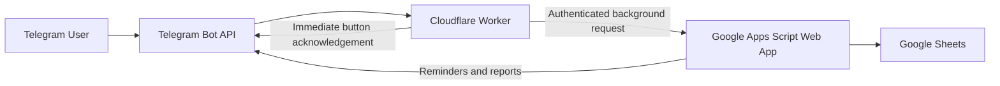

# PulseTask

A personal, serverless Telegram productivity and wellbeing system powered by **Cloudflare Workers**, **Google Apps Script**, and **Google Sheets**.

PulseTask turns a weekly Google Sheets schedule into an interactive Telegram assistant. It sends reminders, records task actions and energy levels, creates daily and weekly reports, generates an energy heatmap, and moves interrupted tasks to the nearest available free time.

This edition is intentionally designed for **one personal user**.

- No VPS
- No paid database
- No separate backend server
- No multi-user complexity
- No computer required to remain online

## Architecture



### Responsibilities

- **Telegram Bot** provides the user interface.
- **Cloudflare Worker** receives Telegram webhooks and responds to buttons immediately.
- **Google Apps Script** handles schedule logic, rescheduling, reports, triggers, and Google Sheets operations.
- **Google Sheets** stores the weekly plan and generated logs.

## Main features

- Individual reminders approximately one hour before each task
- Reminder check every five minutes
- Duplicate reminder prevention
- Done, Skip, Start, Pause, and Later actions
- `Later 30m` creates a real rescheduled task
- Smart rescheduling to the nearest valid free slot
- Dynamic tasks can be completed, skipped, postponed, or rescheduled again
- Energy tracking from 1 to 5
- Daily and seven-day reports
- Productive-time calculation
- Completion-rate calculation
- Best work category
- Best energy hour
- Seven-day hourly energy heatmap
- Weekly Friday report
- Automatic task-cell status colors
- Secure Worker-to-Apps-Script shared secret
- Script Properties for credentials
- Safe initialization without deleting existing data
- Lightweight internal tests

## Repository files

```text
pulse-task/
├── README.md
├── apps-script/
│   └── Code.gs
└── cloudflare-worker/
    ├── package.json
    ├── wrangler.jsonc
    └── src/
        └── index.js
```

The three essential source files in this release are:

```text
Code.gs
index.js
README.md
```

## Google Sheets schedule

The first row of the main schedule sheet must contain these exact headers:

```text
Start | Finish | Time Duration | State | Saturday | Sunday | Monday | Tuesday | Wednesday | Thursday | Friday
```

Example:

| Start | Finish | Time Duration | State | Monday | Tuesday |
|---|---|---|---|---|---|
| 06:30 | 08:30 | 02:00 | Health/GYM | Gym | Gym |
| 09:00 | 11:00 | 02:00 | Deep Work | Product design | Research |
| 13:00 | 14:00 | 01:00 | Learning | Read a paper | Online course |

Ignored values:

```text
blank
-
—
N/A
NA
null
undefined
```

Supported time formats:

```text
06:30
6:30
17:30
6:30 AM
11:30 PM
```

Tasks crossing midnight are supported:

```text
23:30 → 00:30
```

## Generated sheets

PulseTask creates and manages:

```text
Action_Log
Mood_Log
Reminder_Log
Dynamic_Schedule
Weekly_Report
Energy_Heatmap
```

### Action_Log

Stores task interactions such as:

```text
Pending
Done
Skipped
Started
Paused
Later 30m
Rescheduled
Energy 1/5 ... Energy 5/5
```

### Mood_Log

Stores energy level, mood label, task, category, date, hour, and source.

### Reminder_Log

Prevents the same reminder from being sent repeatedly.

### Dynamic_Schedule

Stores tasks moved by Smart Reschedule or Later 30m without modifying the original weekly schedule.

Important columns:

```text
Dynamic ID
Original Date
Schedule Date
Original Row
Original Start
Original Finish
Previous Task Ref
New Start
New Finish
State
Status
Task
Reason
Reschedule Count
```

Possible statuses:

```text
Active
Completed
Skipped
Superseded
```

Static task reference:

```text
S12
```

Dynamic task reference:

```text
D20260702-R12-V1
```

## Smart rescheduling

Each reminder contains:

```text
🔄 Reschedule to Free Time
```

The rescheduling engine:

1. Calculates the task duration.
2. Reads static and active dynamic tasks.
3. Excludes the task currently being moved.
4. Adds a configurable buffer around busy intervals.
5. checks gaps between tasks.
6. Checks the free period after the final task of the day.
7. Searches future days when today has no suitable slot.
8. Creates a new row in `Dynamic_Schedule`.
9. Marks the previous dynamic version as `Superseded` when necessary.
10. Sends the new date and time to Telegram.

Default configuration:

```javascript
RESCHEDULE_DAY_START: '06:00',
RESCHEDULE_DAY_END: '23:00',
RESCHEDULE_BUFFER_MINUTES: 5,
RESCHEDULE_STEP_MINUTES: 5,
RESCHEDULE_SEARCH_DAYS: 7
```

## Real Later 30m

The Later button no longer records only a log entry.

```text
🔁 Later
```

It now:

```text
Current task
→ Wait at least 30 minutes
→ Find the nearest conflict-free slot
→ Create a dynamic override
→ Send the new time to Telegram
→ Send a new reminder before the moved task
```

If the exact time 30 minutes later is occupied, PulseTask selects the next valid free slot.

## Telegram buttons

```text
✅ Done
⏭ Skip
⏱ Start
⏸ Pause
🔁 Later
🔄 Reschedule to Free Time
🔥1 🔥2 🔥3 🔥4 🔥5
📊 Today
📈 Week
🟩 Heatmap
```

Callback examples:

```text
done:S12
skip:S12
start:S12
pause:S12
later30:S12
reschedule:S12
energyval:S12:4
report:today
report:week
report:heatmap
```

Old row-only callback values such as `done:12` are still accepted for backward compatibility.

## Telegram commands

```text
/start
/test
/today
/week
/heatmap
```

| Command | Result |
|---|---|
| `/start` | Shows bot help |
| `/test` | Sends test buttons for the configured test row |
| `/today` | Generates today's report |
| `/week` | Generates the last seven days report |
| `/heatmap` | Rebuilds the energy heatmap |

The test row is configured in `index.js`:

```javascript
const TEST_ROW = 12;
```

## 1. Create the Telegram bot

Open the official `@BotFather` account and send:

```text
/newbot
```

Choose a display name and a username ending in `bot`.

BotFather returns the Telegram bot token.

Never commit the real token to GitHub.

Open the new bot and send:

```text
/start
```

Recommended BotFather commands:

```text
start - Show bot help
test - Send test buttons
today - Generate today's report
week - Generate the weekly report
heatmap - Update the energy heatmap
```

## 2. Get the Telegram chat ID

Send `/start` to the bot, then run:

```powershell
$BOT_TOKEN = "YOUR_TELEGRAM_BOT_TOKEN"

Invoke-RestMethod `
  -Uri "https://api.telegram.org/bot$BOT_TOKEN/getUpdates"
```

Find:

```text
message → chat → id
```

## 3. Configure Apps Script Properties

Open:

```text
Google Sheet
→ Extensions
→ Apps Script
→ Project Settings
→ Script Properties
```

Create:

| Property | Example |
|---|---|
| `TELEGRAM_BOT_TOKEN` | BotFather token |
| `TELEGRAM_CHAT_ID` | Personal numeric chat ID |
| `WORKER_API_SECRET` | Long random private value |
| `MAIN_SHEET_NAME` | `Time/Plan` or your sheet name |
| `TIMEZONE` | `Asia/Tehran` |

The value of `WORKER_API_SECRET` must exactly match the Cloudflare secret with the same name.

## 4. Install Apps Script code

Open:

```text
Extensions → Apps Script
```

Replace the existing code with `Code.gs`.

Set the Apps Script project timezone to match the `TIMEZONE` Script Property.

## 5. Initialize PulseTask

Run:

```javascript
initializePulseTask
```

This function:

- Validates Script Properties
- Validates the main sheet and headers
- Creates only missing generated sheets
- Preserves existing logs and data
- Installs the required triggers
- Builds the initial heatmap
- Sends a successful initialization message

It is safe to run again.

For a complete reset of generated sheets and colors, run:

```javascript
fullResetSystem
```

This does not delete the main weekly schedule.

## 6. Run internal tests

Run:

```javascript
runPulseTaskTests
```

Tests include:

- 24-hour time parsing
- 12-hour time parsing
- Normal duration
- Cross-midnight duration
- Static and dynamic task references
- Free-slot detection

These tests do not modify schedule data.

## 7. Deploy Apps Script

Open:

```text
Deploy
→ New deployment
→ Web app
```

Use:

```text
Execute as: Me
Who has access: Anyone
```

Copy the URL ending in `/exec`.

This is the Cloudflare secret:

```text
APPS_SCRIPT_URL
```

After changing `Code.gs`:

```text
Deploy
→ Manage deployments
→ Edit
→ New version
→ Deploy
```

## 8. Configure Cloudflare Worker

The Worker needs:

```text
TELEGRAM_BOT_TOKEN
TELEGRAM_CHAT_ID
APPS_SCRIPT_URL
WORKER_API_SECRET
```

Set them:

```powershell
npx wrangler secret put TELEGRAM_BOT_TOKEN
npx wrangler secret put TELEGRAM_CHAT_ID
npx wrangler secret put APPS_SCRIPT_URL
npx wrangler secret put WORKER_API_SECRET
```

The Worker validates that all required environment variables exist and returns a clear configuration error if one is missing.

## 9. Worker configuration

Example `wrangler.jsonc`:

```json
{
  "$schema": "node_modules/wrangler/config-schema.json",
  "name": "pulse-task-worker",
  "main": "src/index.js",
  "compatibility_date": "2026-07-02",
  "workers_dev": true
}
```

Example `package.json`:

```json
{
  "name": "pulse-task-worker",
  "version": "2.3.0",
  "private": true,
  "type": "module",
  "scripts": {
    "dev": "wrangler dev",
    "deploy": "wrangler deploy",
    "tail": "wrangler tail"
  },
  "devDependencies": {
    "wrangler": "^4.106.0"
  }
}
```

Expected structure:

```text
cloudflare-worker/
├── package.json
├── wrangler.jsonc
└── src/
    └── index.js
```

## 10. Deploy Worker

```powershell
npm install
npx wrangler login
npx wrangler deploy
```

Opening the Worker URL in a browser should return a JSON health response.

## 11. Set Telegram webhook

The Telegram webhook must point only to the Cloudflare Worker.

```powershell
$BOT_TOKEN = "YOUR_TELEGRAM_BOT_TOKEN"
$WORKER_URL = "https://pulse-task-worker.YOUR-SUBDOMAIN.workers.dev"

Invoke-RestMethod `
  -Uri "https://api.telegram.org/bot$BOT_TOKEN/setWebhook" `
  -Method Post `
  -ContentType "application/json" `
  -Body (@{
    url = $WORKER_URL
    drop_pending_updates = $true
  } | ConvertTo-Json)
```

Verify:

```powershell
Invoke-RestMethod `
  -Uri "https://api.telegram.org/bot$BOT_TOKEN/getWebhookInfo"
```

## Triggers

`initializePulseTask` installs:

```text
checkUpcomingTaskReminders
→ Every 5 minutes

sendWeeklyWellbeingReport
→ Friday around 23:45
```

The installation function deletes old project triggers first, preventing duplicate trigger execution.

## Reminder timing

Default reminder settings:

```text
60 minutes before the task
±5-minute reminder window
Trigger every 5 minutes
```

For a task starting at `09:00`, the reminder normally arrives around `08:00`.

## Testing workflow

Recommended order:

```text
1. Run initializePulseTask
2. Run runPulseTaskTests
3. Run testTelegram
4. Run testNextUpcomingReminder
5. Send /start
6. Send /test
7. Test Later
8. Test Smart Reschedule
9. Send /today
10. Send /week
```

## Task colors

| Status | Color |
|---|---|
| Pending | Light red |
| Done | Light green |
| Skipped | Light orange |
| Started | Light blue |
| Paused / moved | Light purple |
| Default | White |

## Security

Real credentials must exist only in:

### Apps Script Properties

```text
TELEGRAM_BOT_TOKEN
TELEGRAM_CHAT_ID
WORKER_API_SECRET
MAIN_SHEET_NAME
TIMEZONE
```

### Cloudflare Secrets

```text
TELEGRAM_BOT_TOKEN
TELEGRAM_CHAT_ID
APPS_SCRIPT_URL
WORKER_API_SECRET
```

Never commit credentials into:

```text
Code.gs
index.js
README.md
wrangler.jsonc
Git history
screenshots
```

The Worker also rejects Telegram updates from chat IDs other than the configured personal chat ID.

## Troubleshooting

### Worker live logs

```powershell
npx wrangler tail
```

### Apps Script returns HTML

Use the deployed `/exec` URL, not `/dev`.

Deployment access must be:

```text
Execute as: Me
Who has access: Anyone
```

### No reminder arrives

Check:

- `checkUpcomingTaskReminders` trigger exists
- Project timezone matches the schedule
- Task time format is valid
- Today column name is correct
- Reminder was not already written to `Reminder_Log`
- Task starts within the reminder window

### Reschedule finds no free time

Check:

- `RESCHEDULE_DAY_END`
- `RESCHEDULE_SEARCH_DAYS`
- Task duration
- Busy intervals
- Five-minute buffer
- Active rows in `Dynamic_Schedule`

### Later does not use exactly 30 minutes later

This is expected when that time conflicts with another task. PulseTask searches for the first valid slot at or after the requested delay.

### Changes to Apps Script are not visible

Deploy a new Web App version:

```text
Deploy → Manage deployments → Edit → New version → Deploy
```

### Changes to Worker are not visible

Run:

```powershell
npx wrangler deploy
```

## Personal Edition scope

PulseTask Personal Edition deliberately does not include:

```text
Multi-user accounts
Public registration
Paid database
VPS
Subscription system
Separate authentication service
Complex SaaS infrastructure
```

The goal is a fast, reliable, free, personal system using the existing serverless architecture.

## License

MIT
