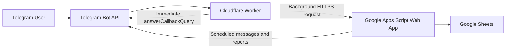

# Telegram Life Tracker

A fast, serverless Telegram productivity and wellbeing tracker powered by **Cloudflare Workers**, **Google Apps Script**, and **Google Sheets**.

The project turns a weekly schedule spreadsheet into an interactive Telegram assistant. It sends upcoming tasks, records task status, captures energy levels, produces daily and weekly analytics, and builds an hourly energy heatmap.

## Why this architecture?

A first version built entirely with Google Apps Script worked, but Telegram button responses could feel slow because Apps Script may cold-start and each click may read or write a spreadsheet before Telegram receives confirmation.

This version separates responsibilities:



- **Cloudflare Worker** handles Telegram webhooks and acknowledges button clicks immediately.
- **Google Apps Script** handles spreadsheet operations, analytics, scheduled reminders, and heatmap generation.
- **Google Sheets** stores the schedule, actions, energy logs, reports, and heatmap.
- No VPS is required, and the user's computer does not need to stay on.

## Features

- Sends the next four hours of today's schedule to Telegram
- Inline actions: Done, Skip, Start, Pause, Later 30m
- Direct energy buttons from 1 to 5
- Fast Telegram feedback before spreadsheet work begins
- Daily and seven-day analytics
- Productive-time calculation
- Completion-rate calculation
- Best work category
- Best energy hour
- Hour-by-hour energy heatmap
- Friday-night weekly report
- Duplicate Done/Skip protection
- Shared-secret authentication between Worker and Apps Script
- Script Properties and Cloudflare Secrets instead of committed credentials

## Repository structure

```text
telegram-life-tracker-cloudflare/
├── README.md
├── LICENSE
├── CONTRIBUTING.md
├── SECURITY.md
├── .gitignore
├── apps-script/
│   ├── Code.gs
│   └── appsscript.json
├── cloudflare-worker/
│   ├── package.json
│   ├── wrangler.jsonc
│   ├── .dev.vars.example
│   └── src/
│       └── index.js
├── docs/
│   ├── ARCHITECTURE.md
│   ├── SETUP.md
│   ├── GOOGLE_SHEETS_SCHEMA.md
│   ├── OPERATIONS.md
│   ├── TESTING.md
│   ├── TROUBLESHOOTING.md
│   ├── SECURITY_GUIDE.md
│   ├── DEVELOPMENT.md
│   ├── ROADMAP.md
│   └── MASTER_PROMPT.md
├── examples/
│   ├── sample_schedule.csv
│   └── powershell_commands.md
└── .github/
    └── ISSUE_TEMPLATE/
```

## Prerequisites

- A Google account
- A Telegram account
- A Telegram bot created through `@BotFather`
- A Cloudflare account
- Node.js 22 or newer
- npm
- A Google Sheet containing the schedule columns described below

## Main schedule schema

The first row of the main sheet must include these exact headers:

```text
Start | Finish | Time Duration | State | Saturday | Sunday | Monday | Tuesday | Wednesday | Thursday | Friday
```

Example:

| Start | Finish | State | Monday | Tuesday |
|---|---|---|---|---|
| 06:30 | 08:30 | Health/GYM | Gym | Gym |
| 09:00 | 11:00 | Deep Work | Product design | Research |

Blank cells, `-`, `—`, `N/A`, and `NA` are ignored.

## Generated sheets

Apps Script automatically creates:

- `Action_Log`
- `Mood_Log`
- `Weekly_Report`
- `Energy_Heatmap`

## Quick start

For full instructions, read [docs/SETUP.md](docs/SETUP.md).

### 1. Create the Telegram bot

1. Open `@BotFather` in Telegram.
2. Run `/newbot`.
3. Save the bot token securely.
4. Send `/start` to your new bot.
5. Retrieve your numeric chat ID.

Never commit the bot token.

### 2. Prepare the Google Sheet

Create the required schedule headers and add your weekly tasks. Open:

```text
Extensions → Apps Script
```

Paste the contents of `apps-script/Code.gs` into the Apps Script editor.

### 3. Set Apps Script properties

Open:

```text
Apps Script → Project Settings → Script Properties
```

Create:

| Property | Value |
|---|---|
| `TELEGRAM_BOT_TOKEN` | Telegram bot token |
| `TELEGRAM_CHAT_ID` | Numeric Telegram chat ID |
| `WORKER_API_SECRET` | A long random shared secret |
| `MAIN_SHEET_NAME` | Usually `Sheet1` |
| `TIMEZONE` | Example: `Asia/Tehran` |

The `WORKER_API_SECRET` must exactly match the Cloudflare secret configured later.

### 4. Deploy Apps Script as a Web App

Use:

```text
Deploy → New deployment → Web app
Execute as: Me
Who has access: Anyone
```

Copy the URL ending in `/exec`.

### 5. Install and deploy the Worker

```powershell
cd cloudflare-worker
npm install
npx wrangler login
npx wrangler secret put TELEGRAM_BOT_TOKEN
npx wrangler secret put TELEGRAM_CHAT_ID
npx wrangler secret put APPS_SCRIPT_URL
npx wrangler secret put WORKER_API_SECRET
npx wrangler deploy
```

Enter the Apps Script `/exec` URL for `APPS_SCRIPT_URL`.

### 6. Point Telegram webhook to the Worker

In PowerShell:

```powershell
$BOT_TOKEN = "YOUR_NEW_BOT_TOKEN"
$WORKER_URL = "https://YOUR-WORKER.YOUR-SUBDOMAIN.workers.dev"
Invoke-RestMethod -Uri "https://api.telegram.org/bot$BOT_TOKEN/setWebhook" -Method Post -ContentType "application/json" -Body (@{url=$WORKER_URL; drop_pending_updates=$true} | ConvertTo-Json)
```

Verify:

```powershell
Invoke-RestMethod -Uri "https://api.telegram.org/bot$BOT_TOKEN/getWebhookInfo"
```

### 7. Install Apps Script triggers

Run this Apps Script function once:

```javascript
installProjectTriggers
```

It creates:

- `sendNext4HoursPlanToTelegram` every four hours
- `sendWeeklyWellbeingReport` every Friday around 23:45 in the project timezone

### 8. Test

Send to the Telegram bot:

```text
/start
/test
/today
/week
/heatmap
```

Change `TEST_ROW` in `cloudflare-worker/src/index.js` if row 12 is empty today.

## Security model

Two separate secret stores are used:

### Cloudflare Secrets

- `TELEGRAM_BOT_TOKEN`
- `TELEGRAM_CHAT_ID`
- `APPS_SCRIPT_URL`
- `WORKER_API_SECRET`

### Apps Script Properties

- `TELEGRAM_BOT_TOKEN`
- `TELEGRAM_CHAT_ID`
- `WORKER_API_SECRET`
- `MAIN_SHEET_NAME`
- `TIMEZONE`

The shared secret authenticates Worker-to-Apps-Script calls. The Worker also rejects updates from chat IDs other than the configured user.

## Telegram commands

| Command | Result |
|---|---|
| `/start` | Shows help and current commands |
| `/test` | Sends a test task card |
| `/today` | Requests today's report |
| `/week` | Requests the last seven days report |
| `/heatmap` | Rebuilds the seven-day energy heatmap |

## Analytics

### Completion rate

```text
Done tasks / Pending tasks sent × 100
```

### Productive time

The sum of planned durations for tasks marked Done.

### Average energy

The arithmetic mean of all energy values logged in the selected date range.

### Best energy hour

The date-hour bucket with the highest average energy value.

## Operational notes

- Telegram webhook must point only to the Cloudflare Worker.
- Apps Script is an authenticated backend endpoint, not the Telegram webhook.
- After changing Apps Script code, deploy a new Apps Script Web App version.
- After changing Worker code or secrets, run `npx wrangler deploy`.
- The user computer may be off after deployment.

## Troubleshooting

Start Worker live logs:

```powershell
npx wrangler tail
```

Check Telegram webhook:

```powershell
Invoke-RestMethod -Uri "https://api.telegram.org/bot$BOT_TOKEN/getWebhookInfo"
```

Open the Apps Script `/exec` URL in a browser. It should return a JSON health response.

See [docs/TROUBLESHOOTING.md](docs/TROUBLESHOOTING.md) for detailed cases.

## Open-source readiness checklist

Before publishing:

- Revoke any token that has ever been pasted publicly
- Confirm no token exists in Git history
- Confirm `.dev.vars` is ignored
- Confirm only placeholders exist in examples
- Replace personal names and chat IDs in screenshots
- Add repository screenshots only after removing sensitive data

## License

MIT License. See [LICENSE](LICENSE).
