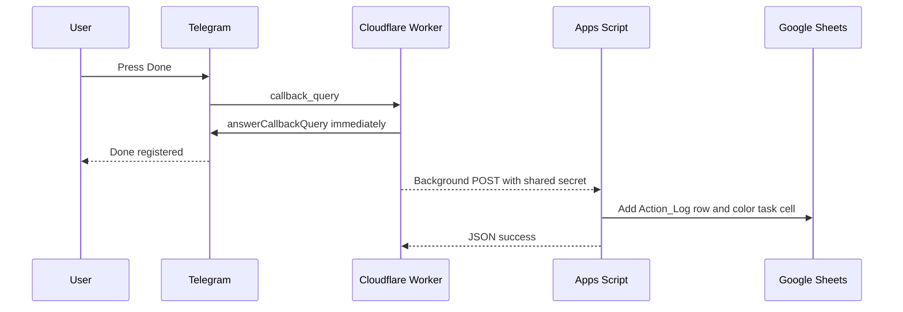
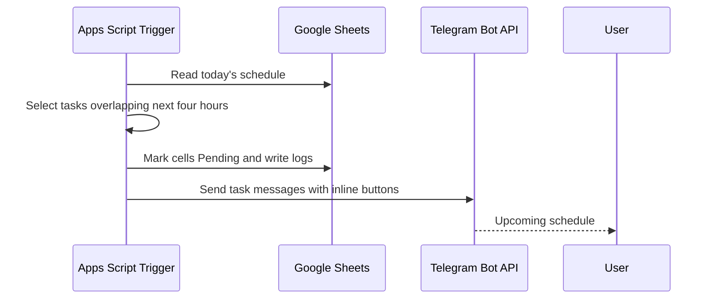

# Architecture

## Components

### Telegram Bot API
Receives user commands and button clicks. The webhook URL points to the Cloudflare Worker.

### Cloudflare Worker
The latency-sensitive edge layer. It authenticates the Telegram chat, parses callbacks, immediately calls `answerCallbackQuery`, and uses `ctx.waitUntil()` to call Apps Script without blocking the user-facing response.

### Google Apps Script Web App
The spreadsheet and analytics backend. It validates a shared secret, updates logs and colors, generates reports, and sends scheduled Telegram messages.

### Google Sheets
The persistent data store and visual dashboard.

## Request flow: task button

## Request flow: scheduled reminder

## Trust boundaries

1. Telegram signs no shared secret in the update. Security at the Worker relies on the unguessable webhook URL plus configured chat-ID validation.
2. Worker-to-Apps-Script requests use `WORKER_API_SECRET`.
3. Apps Script stores Telegram credentials in Script Properties.
4. Worker stores credentials with Wrangler secrets.

## Why Apps Script is retained

Apps Script is excellent for spreadsheet-native operations, triggers, and formatting, but less suitable for latency-sensitive Telegram acknowledgements. The split architecture uses each platform for its strongest role.
